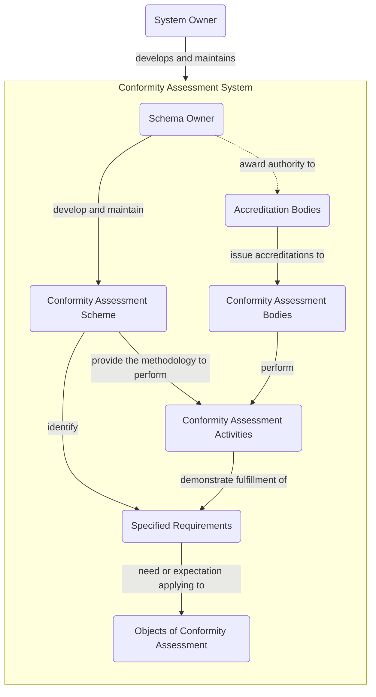

# :simple-mlflow: Conformity Assessment activities

## Workflow

All assessment activities are following the same workflow described below.

The positive result of the conformity assessment activities is an attestation, which is a statement that fulfilment of Specified Requirements has been demonstrated, for a given Conformity Assessment Scheme and [Scope of attestation](https://www.iso.org/obp/ui/#iso:std:iso-iec:17000:ed-2:v2:en:term:7.4).

## Attestation types

Type of [Attestations](https://www.iso.org/obp/ui/#iso:std:iso-iec:17000:ed-2:v2:en:term:7.3) in ISO/IEC 17000:2020 | Example
------------------------------------------------------------------------------------------------------------------|---------
[first-party conformity assessment activity](https://www.iso.org/obp/ui/#iso:std:iso-iec:17000:ed-2:v2:en:term:4.3), also known as [**declaration**](https://www.iso.org/obp/ui/#iso:std:iso-iec:17000:ed-2:v2:en:term:7.5) | a person **self-declaring** itself competent
[second-party conformity assessment activity](https://www.iso.org/obp/ui/#iso:std:iso-iec:17000:ed-2:v2:en:term:4.4) | assessment of a person's knowledge and skills conducted by someone **with the interest** of the person (trainer/instructor).
[third-party conformity assessment activity](https://www.iso.org/obp/ui/#iso:std:iso-iec:17000:ed-2:v2:en:term:4.5), also known as [**certification**](https://www.iso.org/obp/ui/#iso:std:iso-iec:17000:ed-2:v2:en:term:7.6) | assessment of a person's knowledge and skills conducted via a **impartial** exam.
