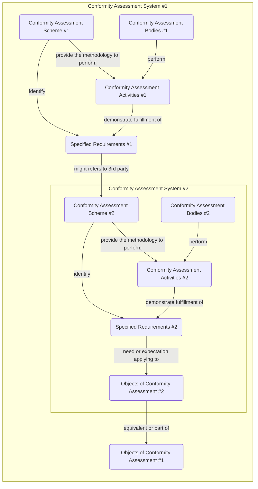

# :material-bowl-mix-outline: Composition of conformity assessment scheme

!!! warning

    A conformity scheme can be composed as described below under the condition that the scopes of the object of conformity `#1` and `#2` are indisputable between the conformity scheme.

In the diagram below, the `Conformity Assessment System #1` is composed of the `Conformity Assessment System #2`.

The `Conformity Assessment System #2` has no impact on `Conformity Assessment System #1`.

!!! example

    The `Conformity Assessment Activities #1` could be fully automated while the `Conformity Assessment Activities #2` could be manual.

!!! example

    For a given ecosytem or domain specific qualification or label, the scheme owner can define a `Conformity Scheme #1` that mandates the acquisition of an ISO/IEC 27001 from a specific list of eligible `CAB #2`.
    Those CAB are a type of Trust Anchors and are listed in a Registry.
