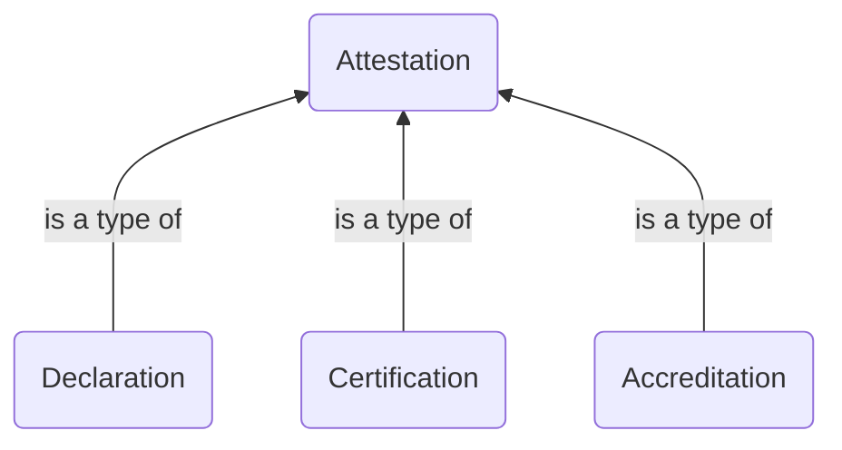

# :material-certificate: Digital Attestation

## The different types of attestation

## Electronic vs Digital

An electronic document or signature is defined as any form of document or signature, accessed, stored or transmitted electronically.  
It includes for example scanned images and documents signed by inserting handwritten signature images.

A digital document or signature is a type of electronic document or signature with structured content or providing additional security and verification of the signer's identity through cryptographic techniques.  
It includes for example data with machine-readable syntax and semantic and cryptographically signed Verifiable Credential.
