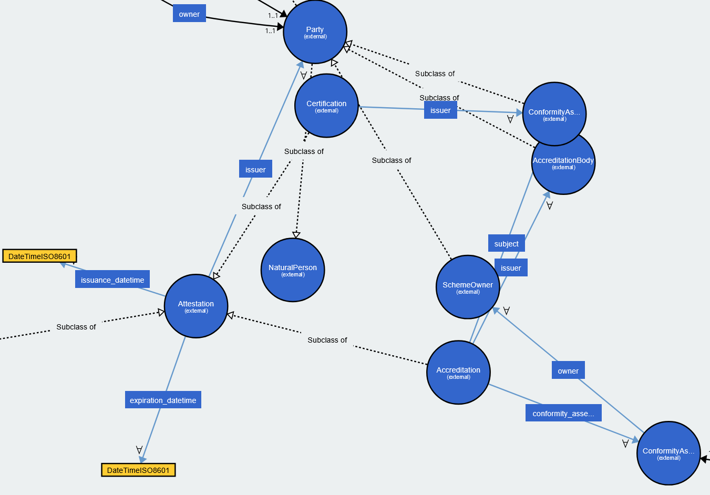

# Ontology

The ontology can be browsed at <https://eclipse-dataspace-cap.github.io/cap-ontology>

???info "Visualisation"
    A 3rd-party visualisation tool is available [here](https://service.tib.eu/webvowl/#iri=https://github.com/eclipse-dataspace-cap/cap-ontology/releases/download/v2.0.1/cap.owl.ttl).

    { width="300" }

## For Developer

Example of `cap:Certification` inside a W3C Verifiable Credential v2.0

The code is primarily using [rdflib](https://rdflib.readthedocs.io/)


```python
#!/usr/bin/env python3

import hashlib
from datetime import datetime, timedelta

import requests
from dateutil.relativedelta import relativedelta
from pyshacl import validate
from rdflib import BNode, Graph, Literal, Namespace, Node
from rdflib.namespace import FOAF, RDF, SDO, XSD

CAP_VERSION = "v2.2.0"

CRED = Namespace("https://www.w3.org/ns/credentials/v2/")
CAP = Namespace(f"https://w3id.org/eclipse-cap/{CAP_VERSION}/#")
GX = Namespace("https://w3id.org/gaia-x/development#")
EX = Namespace("http://example.com/#")


def generate_conformity_assessment() -> tuple[Node, Graph]:
    """function to generate a cap:Certificate"""
    g = Graph()

    certification = EX.TrustedNotary_certification01
    g.add((certification, RDF.type, CAP.Certification))
    g.add((certification, CAP.object, EX.OutScaleSAS_IaaS))

    scheme = BNode()
    g.add((certification, CAP.conformity_assessment_scheme, scheme))
    g.add((scheme, CAP.name, Literal("SecNumCloud")))
    g.add((scheme, CAP.version, Literal("3.2")))
    issuance_date = datetime(year=2023, month=11, day=30)
    valid_from = issuance_date
    valid_until = valid_from + relativedelta(years=3)
    g.add((certification, CAP.valid_from_datetime, Literal(valid_from.isoformat(), datatype=XSD.dateTime)))
    g.add((certification, CAP.valid_until_datetime, Literal(valid_until.isoformat(), datatype=XSD.dateTime)))
    g.add((certification, CAP.issuance_datetime, Literal(issuance_date.isoformat(), datatype=XSD.dateTime)))

    issuer = EX.LNE
    g.add((certification, CAP.issuer, issuer))
    g.add((issuer, RDF.type, CAP.ConformityAssessmentBody))
    g.add((issuer, RDF.type, GX.LegalPerson))
    g.add((issuer, FOAF.name, Literal("LABORATOIRE NATIONAL DE METROLOGIE ET D'ESSAIS", lang="fr")))
    g.add((issuer, SDO.vatID, Literal("FR313320244")))
    return certification, g


def generate_evidence(evidence_url: str) -> tuple[Node, Graph]:
    """function to generate a cred:Evidence (SDK)"""
    g = Graph()

    evidence = BNode()
    g.add((vc, CRED.evidence, evidence))
    g.add((evidence, RDF.type, CRED.evidence))
    g.add((evidence, CRED.value, Literal(evidence_url)))
    evidence_sri = compute_sri(evidence_url)
    g.add((evidence, CRED.digest, Literal(f"sha256-{evidence_sri}")))
    return evidence, g


def compute_sri(url: str) -> str:
    response = requests.get(url, stream=True)
    sha256_hash = hashlib.sha256()
    for chunk in response.iter_content(chunk_size=8192):
        if chunk:
            sha256_hash.update(chunk)
    return sha256_hash.hexdigest()


g = Graph() # create an empty graph
# declare prefix to increase readability
g.bind("cred", CRED)
g.bind("cap", CAP)
g.bind("gx", GX)
g.bind("ex", CRED)

# create an VC ID and declare its properties
vc = EX.myvc
g.add((vc, RDF.type, CRED.VerifiableCredential))
g.add((vc, CRED.issuer, Literal("did:web:trusted-notary.eu")))
valid_from = datetime.now()
valid_until = valid_from + timedelta(days=90)
g.add((vc, CRED.validFrom, Literal(valid_from.isoformat(), datatype=XSD.dateTime)))
g.add((vc, CRED.validUntil, Literal(valid_until.isoformat(), datatype=XSD.dateTime)))

# generate a cap:Certificate and attach it to the VC
certification, graph_certification = generate_conformity_assessment()
g += graph_certification
g.add((vc, CRED.credentialSubject, certification))

# generate a cred:Evidence and attach is to the VC
evidence, graph_evidence = generate_evidence(
    "https://cyber.gouv.fr/sites/default/files/decisions-qualifications/2023_2118_np.pdf"
)
g += graph_evidence
g.add((vc, CRED.evidence, evidence))

# Serialise the graph for manual inspection
print(g.serialize(format="ttl"))

# Load the Eclipse CAP SHACL graph
shacl_graph = Graph()
shacl_graph.parse(
    f"https://github.com/eclipse-dataspace-cap/cap-ontology/releases/download/{CAP_VERSION}/cap.shacl.ttl", format="ttl"
)

# Load the Eclipse Ontology graph
ont_graph = Graph()
ont_graph.parse(
    f"https://github.com/eclipse-dataspace-cap/cap-ontology/releases/download/{CAP_VERSION}/cap.owl.ttl", format="ttl"
)

# Run the SHACL validation (TCK)
r = validate(
    g,
    shacl_graph=shacl_graph,
    ont_graph=ont_graph,
    inference="rdfs",
    abort_on_first=False,
    allow_infos=False,
    allow_warnings=False,
    meta_shacl=False,
    advanced=False,
    js=False,
    debug=False,
)
conforms, results_graph, results_text = r
print("*" * 80)
print(conforms, results_graph, results_text)
```


The output of that script using `pyshacl>=0.30.1`, `python-dateutil>=2.9.0.post0`, `rdflib>=7.1.4`, `requests>=2.32.3`

```text
@prefix cap: <https://w3id.org/eclipse-cap/v2.2.0/#> .
@prefix ex: <https://www.w3.org/ns/credentials/v2/> .
@prefix foaf: <http://xmlns.com/foaf/0.1/> .
@prefix gx: <https://w3id.org/gaia-x/development#> .
@prefix schema: <https://schema.org/> .
@prefix xsd: <http://www.w3.org/2001/XMLSchema#> .

<http://example.com/#myvc> a ex:VerifiableCredential ;
    ex:credentialSubject <http://example.com/#TrustedNotary_certification01> ;
    ex:evidence [ a ex:evidence ;
            ex:digest "sha256-9b860c2fe0bc4200cf2b94369c82f3806f6db093bd92c3f341fee5e676ff1a60" ;
            ex:value "https://cyber.gouv.fr/sites/default/files/decisions-qualifications/2023_2118_np.pdf" ] ;
    ex:issuer "did:web:trusted-notary.eu" ;
    ex:validFrom "2025-05-22T21:36:00.836750"^^xsd:dateTime ;
    ex:validUntil "2025-08-20T21:36:00.836750"^^xsd:dateTime .

<http://example.com/#LNE> a cap:ConformityAssessmentBody,
        gx:LegalPerson ;
    foaf:name "LABORATOIRE NATIONAL DE METROLOGIE ET D'ESSAIS"@fr ;
    schema:vatID "FR313320244" .

<http://example.com/#TrustedNotary_certification01> a cap:Certification ;
    cap:conformity_assessment_scheme [ cap:name "SecNumCloud" ;
            cap:version "3.2" ] ;
    cap:issuance_datetime "2023-11-30T00:00:00"^^xsd:dateTime ;
    cap:issuer <http://example.com/#LNE> ;
    cap:object <http://example.com/#OutScaleSAS_IaaS> ;
    cap:valid_from_datetime "2023-11-30T00:00:00"^^xsd:dateTime ;
    cap:valid_until_datetime "2026-11-30T00:00:00"^^xsd:dateTime .


********************************************************************************
True [a rdfg:Graph;rdflib:storage [a rdflib:Store;rdfs:label 'Memory']]. Validation Report
Conforms: True
```